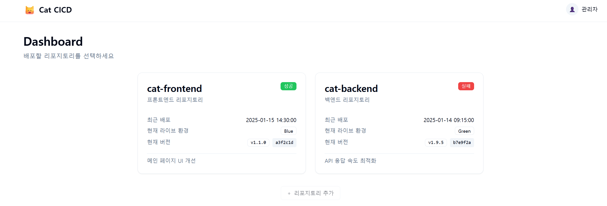

# Cat CICD Frontend

CI/CD 파이프라인을 시각화하고 관리하는 웹 프론트엔드 애플리케이션입니다.



## 기능

- **리포지토리 관리**: 프론트엔드/백엔드 리포지토리 목록 조회
- **배포 현황 대시보드**: 최근 배포 상태, 현재 라이브 환경, 버전 정보 확인
- **버전 관리**: 커밋 기반 버전 리스트 및 배포 내역 조회
- **배포 파이프라인**: 6단계 CI/CD 파이프라인 시각화
  - 테스트 → 보안 점검 → 빌드 → 인프라 확인 → 배포 → 모니터링
- **Blue/Green 배포**: 무중단 배포를 위한 환경 전환 지원

## 기술 스택

- **React 19** + **TypeScript**
- **Vite** - 빌드 도구
- **Tailwind CSS** + **shadcn/ui** - 스타일링
- **React Router v7** - 라우팅
- **Axios** - HTTP 클라이언트

## 시작하기

### 로컬 개발

```bash
# 의존성 설치
npm install

# 개발 서버 실행
npm run dev
```

### Docker

```bash
# 이미지 빌드
docker build -t cat-frontend .

# 컨테이너 실행
docker run -p 3000:3000 cat-frontend
```

## 환경 변수

```bash
# .env.example 참고
VITE_API_BASE_URL=http://localhost:8080
```

## 프로젝트 구조

```
src/
├── api/          # API 클라이언트
├── components/   # UI 컴포넌트
├── hooks/        # 커스텀 훅
├── lib/          # 유틸리티 및 데이터
├── pages/        # 페이지 컴포넌트
├── services/     # 서비스 레이어
└── types/        # 타입 정의
```

## 라이선스

MIT
